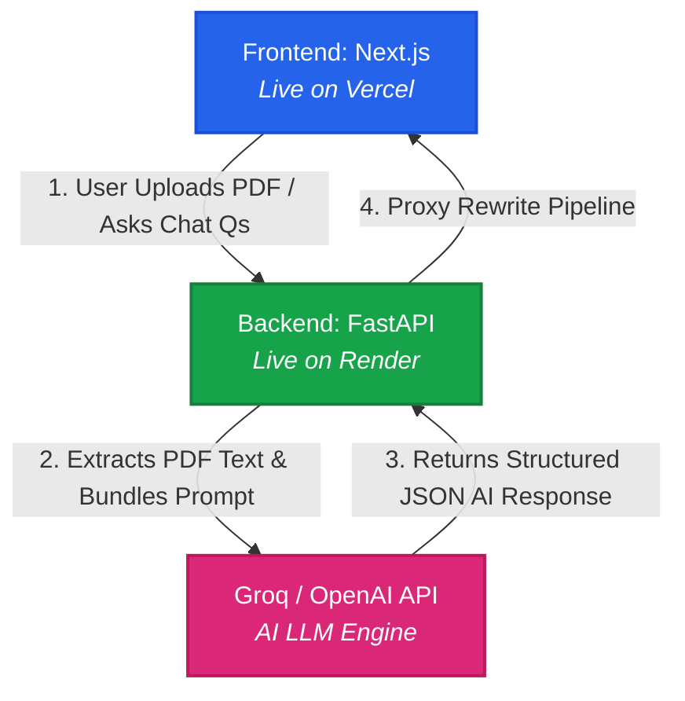

# ⚖️ Legal Doc Analyzer & Chat Assistant

A powerful Full-Stack AI application that simplifies complex legal contracts, flags risky clauses, and allows users to chat directly with their documents to extract critical insights instantly.

🚀 **Live Project Website:** [https://legal-insighter.vercel.app/](https://legal-insighter.vercel.app/)
---

## 🔥 Features

- **📄 Smart PDF Parsing:** Instantly uploads and extracts text from complex legal PDFs.
- **🔍 Automated Summary:** AI generates a bulleted, easy-to-understand breakdown of the document.
- **⚠️ Risk Assessment (Red Flags):** Automatically scans, identifies, and flags hidden or risky clauses with clear reasons.
- **💬 AI Document Chat:** A built-in interactive assistant allowing you to ask natural language questions (e.g., *"What is Notice period?"*) about the uploaded file.
- **🎨 Premium UI:** Styled beautifully with a dark-theme aesthetic using **Tailwind CSS v4** and the clean, rounded **Nunito Sans** font.

---

## 🛠️ Tech Stack

### Frontend
- **Framework:** Next.js 15+ (App Router, TypeScript)
- **Styling:** Tailwind CSS v4, Lucide React (Icons)
- **Deployment:** Vercel

### Backend
- **Framework:** FastAPI (Python 3.14+)
- **Server:** Uvicorn
- **PDF Engine:** PyPDF2
- **AI/LLM Integration:** OpenAI API / Groq SDK (Llama)
- **Deployment:** Render

---

## ⚙️ Architecture & Data Flow



### How It Works:
1. **User Action:** User uploads a PDF or sends a message in the Next.js UI.
2. **Secure Proxy:** Request flows through Vercel Rewrites to bypass CORS errors seamlessly.
3. **Backend Processing:** FastAPI (on Render) receives the request and extracts raw text from the PDF using PyPDF2.
4. **AI Analysis:** Backend bundles the text with system instructions and sends it to the Groq/OpenAI API.
5. **UI Update:** Response flows back to Next.js, updating the component states and rendering the dashboard and chat instantly.

---

## 🚀 Local Setup Instructions

### 1. Clone the Repository
```bash
git clone [https://github.com/ShubhVadke/legal-insighter.git](https://github.com/ShubhVadke/legal-insighter.git)
cd legal-insighter
```

2. Backend Setup
```
cd backend
# Create a virtual environment
python -m venv .venv
source .venv/bin/activate  # On Windows use: .venv\Scripts\activate

# Install dependencies
pip install -r requirements.txt

# Create a .env file and add your API keys
echo "OPENAI_API_KEY=your_key_here" > .env

# Run the backend server
uvicorn app.main:app --reload
```

3. Frontend Setup
```
cd ../frontend
# Install dependencies
npm install

# Run the local development server
npm run dev
Open http://localhost:3000 in your browser to test locally!
````

🌐 Production Deployment Notes
Frontend Config: Uses Vercel's rewrite mechanism (/api/backend/:path*) to securely route requests to the live Render backend, bypassing all CORS production issues.

Tailwind v4 Theme mapping: Nunito Sans font successfully mapped globally via @theme inline and loaded via Next.js Google Fonts loader.

📄 License
This project is licensed under the MIT License.
---

### 🚀 Git Push!
```bash
git add README.md
git commit -m "docs: fixed architecture diagram and cleaned readme formatting"
git push origin main
```
